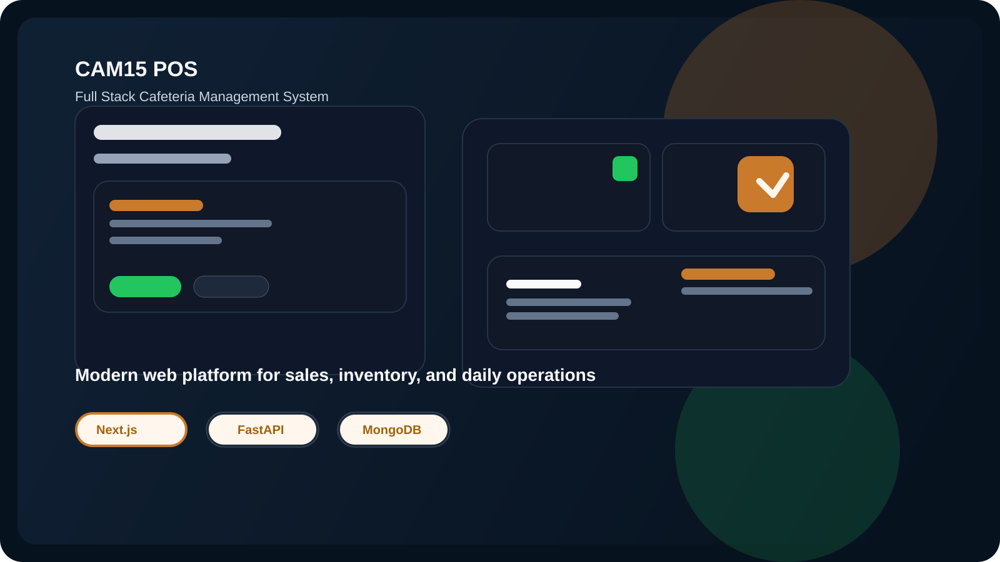
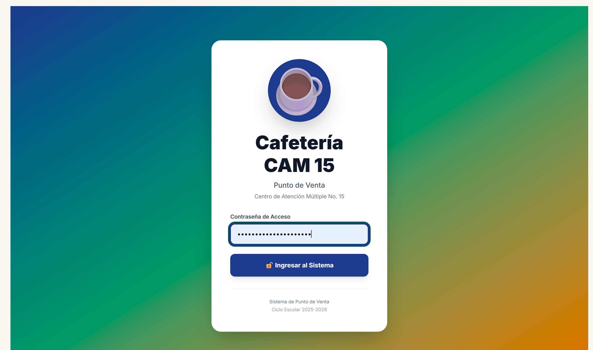
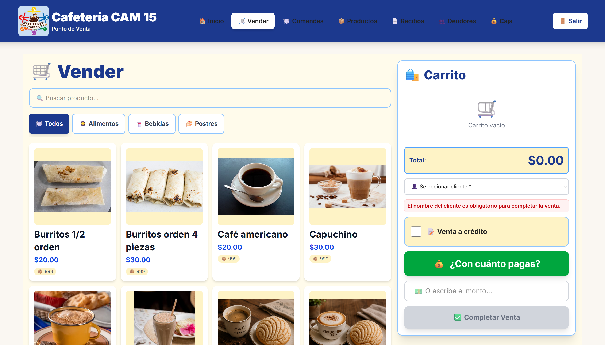
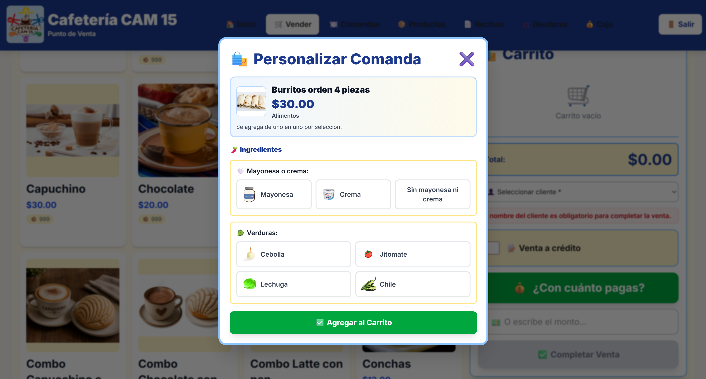
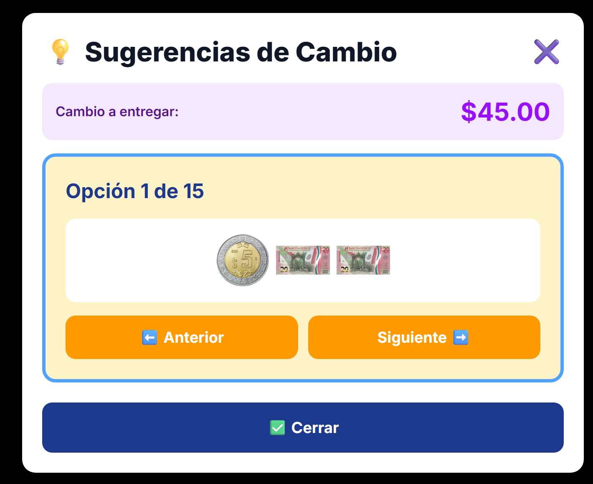
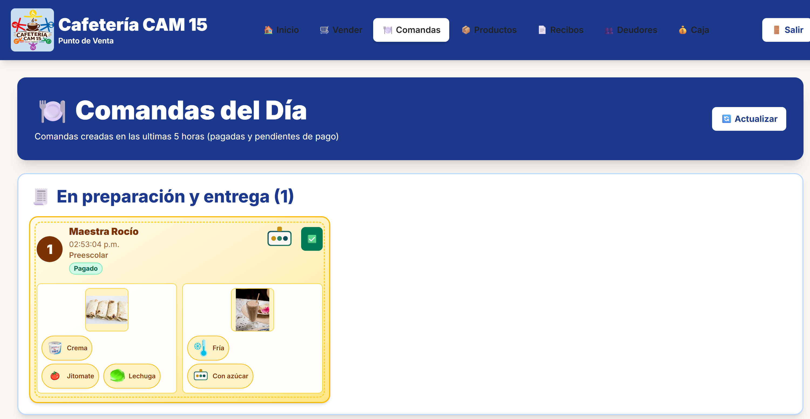

# ☕ CAM15 POS — Full Stack Cafeteria Management System

> A production-oriented Point of Sale (POS) platform built for a vocational training cafeteria at Centro de Atención Múltiple No. 15 (CAM15), helping students with disabilities develop workplace skills through real-world digital tools.

## 🚀 Built for real-world impact



A modern Full Stack solution designed to digitize cafeteria operations, streamline daily workflows, and support vocational training through technology created for real users.

- 🔧 Full Stack web architecture
- 🛒 POS, inventory, cash, and order management
- 📱 Responsive and accessible user experience
- ☁️ Scalable backend with cloud-ready storage

---

## 📖 About the Project

CAM15 Cafeteria Management System is a Full Stack application created to digitize the operations of a school cafeteria used as a learning space within the CAM 15 Vocational Training Workshop.

The system allows users to manage products, record sales, control cash, handle debtors, and generate kitchen orders, offering a simple and intuitive solution for an educational environment.

This project represents the evolution of an application originally built in Kivy into a modern web architecture based on Next.js and FastAPI.

It combines practical business functionality with an educational purpose, making it a strong example of how technology can support real-world operations while also creating meaningful learning experiences.

---

## 🎯 Project Overview

This project was designed and developed as a complete Full Stack solution to address a real need in a work environment, transforming a traditional cafeteria workflow into a scalable web platform.

The system provides digital tools for daily cafeteria operations, including sales management, inventory control, order preparation, and financial tracking, built for real users in a practical and operational context.

### My Role

Full Stack Developer responsible for:

- Designing the application architecture
- Developing the frontend interface
- Building REST APIs
- Integrating MongoDB database operations
- Implementing file storage with AWS S3
- Creating responsive user interfaces
- Deploying and configuring the application environment

---

## ✨ Features

- 🛒 Point of Sale (POS)
- 📦 Product management
- 🖼️ Image upload
- 💳 Sales registration
- 🧾 Digital receipts
- 💰 Cash control
- 👥 Debtor management
- 🍔 Kitchen orders
- ☁️ AWS S3 storage
- 📱 Responsive design

---

## 🏗 Architecture

### Frontend

- Next.js 16
- React 19
- TypeScript
- Tailwind CSS 4

### Backend

- FastAPI
- Python 3.11

### Database

- MongoDB

### Storage

- AWS S3
- Local storage in backend/uploads

---

## 📸 Screenshots

<p align="center">
  
  
</p>

<p align="center">
  
  
</p>

<p align="center">
  
</p>

---

## 🚀 Installation

### Clone the repository

```bash
git clone https://github.com/GloDelMar/CAM15_cafeteria-management-system.git
```

### Backend

```bash
cd backend

python -m venv venv

pip install -r requirements.txt

uvicorn main:app --reload
```

### Frontend

```bash
cd frontend

npm install

npm run dev
```

---

## ⚙ Environment Variables

### Backend

```env
MONGODB_URI=
MONGODB_DB=
AWS_S3_BUCKET=
AWS_REGION=
AWS_ACCESS_KEY_ID=
AWS_SECRET_ACCESS_KEY=
```

### Frontend

```env
NEXT_PUBLIC_API_URL=
NEXT_PUBLIC_AUTH_PASSWORD=
```

---

## 📂 Project Structure

```text
cafeteria_cam15/

├── frontend/
├── backend/
├── kivy_app/
└── README.md
```

---

## 💡 What I Learned

During the development of this project, I strengthened my knowledge in:

- Full Stack architecture
- REST APIs with FastAPI
- MongoDB
- Frontend-backend integration
- File handling in AWS S3
- Designing systems for real users
- Organizing scalable projects

---

## 🔮 Future Improvements

- Role-based authentication
- Reports and statistics
- Advanced admin panel
- Automatic ticket printing
- Dashboard with metrics
- Real-time notifications

---

## 👩‍💻 Author

**Gloriela Suárez Castañeda**

Full Stack Developer

GitHub: https://github.com/GloDelMar

---

## 📄 License

This project is proprietary and all rights are reserved. To review the full legal terms, please consult [LICENSE](LICENSE).

> Reproduction, distribution, modification, or unauthorized use of this software is strictly prohibited without written permission from the author.
